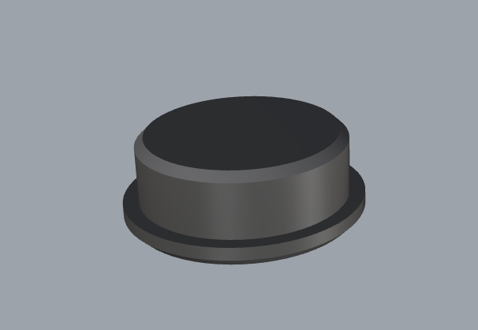
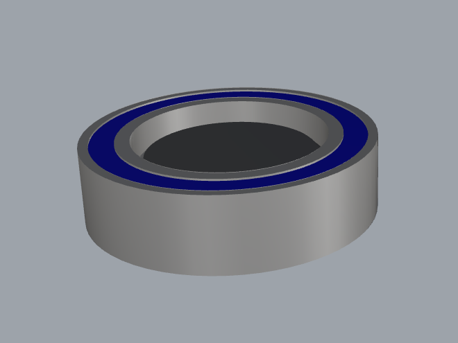
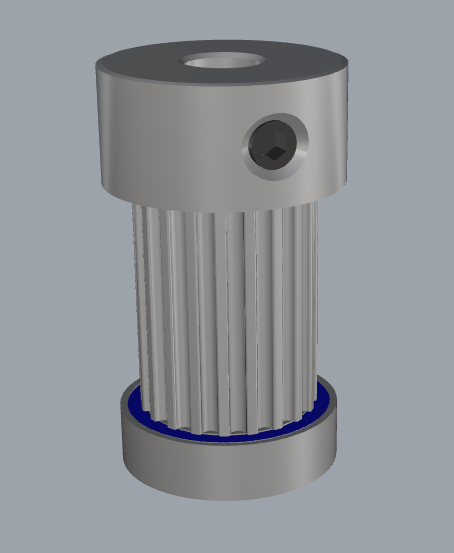

<a href="..">Back to home directory</a> 
 
Start by removing the top flange from the pulley  
I used a adjustable-joint pliers to do this. Put it on the flange and bend the flange, it will pop of the pulley.  

 
Place the bearing jig on a flat surface  

 
Place the bearing over the jig  

 
Put the removed flange surface for the pulley on top of the bearing  

 
Take a hammer and gently tap the pulley  
DON'T DO THIS WITHOUT JIG, YOU WILL DAMAGE THE BEARING <br.
