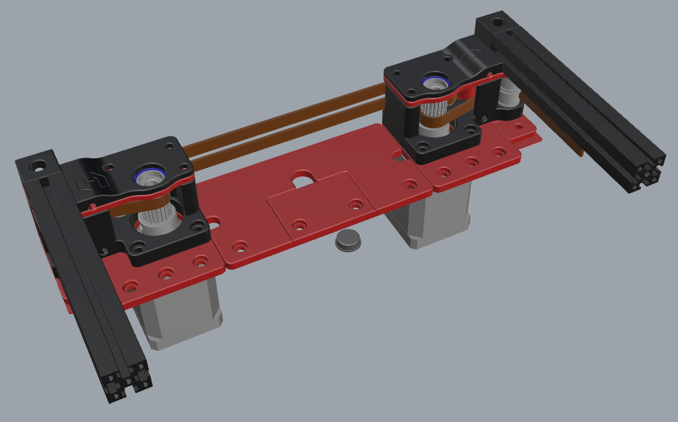

# &#x2B22; BETA HX0 Dual Share motor mount &#x2B22;
This is still beta version. Only the CAD is shared, that other HX0 users can help make it a final version  

The used pulleys specs are:  
- Boring Diameter: 5mm  
- Width: Fit Belt Width 15mm  
- 2GT 20teeth  
 
Link to used pulleys from my beta: <a href="https://nl.aliexpress.com/item/1005004581737746.html?spm=a2g0o.order_list.order_list_main.286.4f6679d2OTcNkG&gatewayAdapt=glo2nld">Click here</a>  
 
The pulleys need to be modified, follow the next link, what to do with them:  
<a href="assets/prepare_pulley.md">Prepare pulley for dual share</a>
